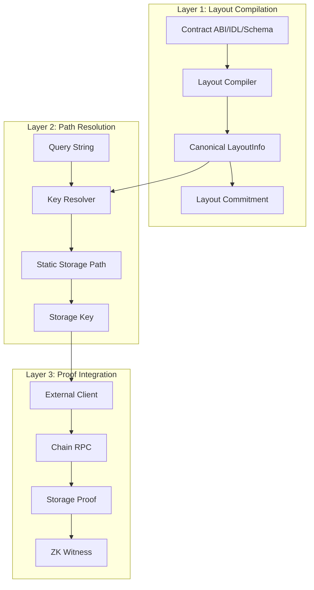
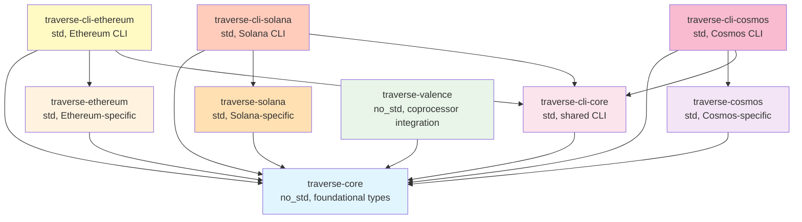

# Traverse Architecture

Traverse is a ZK storage path generator designed for blockchain state verification in zero-knowledge circuits. The system provides deterministic storage key generation and proof verification capabilities optimized for the Valence coprocessor infrastructure.

### Design Principles

- **Deterministic**: All operations produce identical results across environments
- **no_std Compatible**: Core functionality works in constrained WASM/RISC-V circuit environments
- **Modular**: Clean separation between setup and execution phases
- **Multi-ecosystem**: Supports Ethereum, Solana, and Cosmos blockchains
- **Isolated Builds**: Each blockchain ecosystem builds independently due to dependency conflicts

## System Architecture

### Three-Layer Architecture



#### Layer 1: Layout Compilation
Converts chain-specific contract layouts into canonical, deterministic format.

**Implementations**:
- `EthereumLayoutCompiler`: Processes Solidity storage layouts from ABIs
- `SolanaLayoutCompiler`: Processes Anchor IDL layouts
- `CosmosLayoutCompiler`: Processes CosmWasm schema layouts
- Generates `LayoutInfo` with normalized field information
- Computes SHA256-based layout commitment for circuit safety

**Output**: Canonical `LayoutInfo` with commitment hash for verification

#### Layer 2: Path Resolution
Generates deterministic storage keys from human-readable queries.

**Implementations**:
- `EthereumKeyResolver`: Ethereum-specific storage key derivation (Keccak256)
- `SolanaAccountResolver`: Solana account and offset resolution
- `CosmosKeyResolver`: Cosmos storage key generation
- Supports mappings, arrays, structs, and packed fields
- Produces `StaticKeyPath` with layout commitment verification

**Output**: Storage keys ready for blockchain queries and ZK circuit verification

#### Layer 3: Proof Integration
Bridges between blockchain state and ZK circuit verification.

**Implementation**:
- Chain-specific CLI tools for external storage key generation
- `traverse-valence` crate for coprocessor integration
- Controller, circuit, and domain helpers for witness creation
- Support for batch operations and error handling

**Output**: ZK witnesses and validated state proofs

## Crate Overview

Traverse is organized into nine specialized crates, structured to handle the incompatible dependencies between blockchain ecosystems:

### Core Crates

#### traverse-core
**Purpose**: Foundation types and traits for chain-independent storage operations  
**Environment**: `no_std` compatible for circuit usage  
**Key Responsibility**: Defines the core abstractions (`LayoutInfo`, `StaticKeyPath`, `Key`, `ZeroSemantics`) that all other crates build upon  
**Usage**: Included in ZK circuits where memory and dependencies are constrained  

### Blockchain Implementation Crates

#### traverse-ethereum  
**Purpose**: Ethereum-specific implementations of core traits  
**Environment**: Standard library with network access  
**Key Responsibility**: Converts Solidity ABIs to canonical layouts, resolves storage queries to Ethereum storage keys using Keccak256  
**Dependencies**: Uses lightweight Alloy integration to avoid heavy dependencies  
**Usage**: Build tools and external clients that need to interact with Ethereum contracts  

#### traverse-solana
**Purpose**: Solana-specific implementations of core traits  
**Environment**: Standard library with network access  
**Key Responsibility**: Converts Anchor IDLs to canonical layouts, resolves account data queries  
**Dependencies**: Solana SDK, Anchor framework, SPL token  
**Usage**: Build tools and external clients that need to interact with Solana programs  

#### traverse-cosmos
**Purpose**: Cosmos-specific implementations of core traits  
**Environment**: Standard library with network access  
**Key Responsibility**: Converts CosmWasm schemas to canonical layouts, resolves storage queries  
**Dependencies**: Cosmos SDK proto, CosmWasm std, ICS23  
**Usage**: Build tools and external clients that need to interact with Cosmos contracts  

### CLI Crates

The CLI is split into multiple crates to handle incompatible dependencies between blockchain ecosystems:

#### traverse-cli-core
**Purpose**: Shared CLI functionality and traits  
**Environment**: Standard library  
**Key Responsibility**: Common command structures, error handling, and utilities  
**Usage**: Foundation for ecosystem-specific CLI implementations  

#### traverse-cli-ethereum
**Purpose**: Ethereum-specific CLI commands  
**Environment**: Standard library with filesystem and network access  
**Key Responsibility**: Ethereum layout compilation, query resolution, and proof generation  
**Usage**: Development workflows for Ethereum contracts  

#### traverse-cli-solana
**Purpose**: Solana-specific CLI commands  
**Environment**: Standard library with filesystem and network access  
**Key Responsibility**: Solana IDL processing, account queries, and proof generation  
**Usage**: Development workflows for Solana programs  

#### traverse-cli-cosmos
**Purpose**: Cosmos-specific CLI commands  
**Environment**: Standard library with filesystem and network access  
**Key Responsibility**: CosmWasm schema processing, storage queries, and proof generation  
**Usage**: Development workflows for Cosmos contracts  

### Integration Crate

#### traverse-valence
**Purpose**: Integration layer for Valence coprocessor framework with full message type support  
**Environment**: `no_std` compatible with optional `std` and `alloy` features  
**Key Responsibility**: Bridges between Traverse's storage paths and Valence's three-tier architecture (controller/circuit/domain), provides ABI encoding for Valence Authorization contracts  
**Usage**: ZK circuits and coprocessor applications that need storage proof verification with Valence ecosystem integration  

### Crate Dependencies



The design ensures that circuit-compatible crates (`traverse-core`, `traverse-valence`) remain lightweight with minimal dependencies, while tool crates can use the full standard library for complex operations. The split CLI architecture prevents dependency conflicts between blockchain ecosystems.

## Why Split CLIs?

The blockchain Rust ecosystem has incompatible cryptographic dependencies:

| Ecosystem | k256 Version | secp256k1 Version |
|-----------|--------------|-------------------|
| Ethereum (Alloy) | `^0.14` | `^0.29` |
| Solana SDK | `^0.13` | `^0.28` |

These version conflicts make it impossible to include both Ethereum and Solana support in a single binary. The solution is separate CLI binaries for each ecosystem, with shared functionality in `traverse-cli-core`.

## File Structure

```
traverse/
├── crates/
│   ├── traverse-core/          # Core types and traits (no_std)
│   ├── traverse-ethereum/      # Ethereum-specific implementation
│   ├── traverse-solana/        # Solana-specific implementation
│   ├── traverse-cosmos/        # Cosmos-specific implementation
│   ├── traverse-cli-core/      # Shared CLI functionality
│   ├── traverse-cli-ethereum/  # Ethereum CLI commands
│   ├── traverse-cli-solana/    # Solana CLI commands
│   ├── traverse-cli-cosmos/    # Cosmos CLI commands
│   └── traverse-valence/       # Valence coprocessor integration (no_std)
└── workspace-configs/          # Isolated workspace configurations
    ├── Cargo.toml.core         # Core functionality only
    ├── Cargo.toml.ethereum     # Ethereum + core
    ├── Cargo.toml.solana       # Solana + core
    └── Cargo.toml.cosmos       # Cosmos + core
```

## Core Components

### traverse-core

Core traits, types, and no_std-compatible functionality.

**Key Components**:
```rust
pub trait LayoutCompiler {
    fn compile_layout(&self, source: &str) -> Result<LayoutInfo>;
}

pub trait KeyResolver {
    fn resolve(&self, layout: &LayoutInfo, query: &str) -> Result<StaticKeyPath>;
    fn resolve_all(&self, layout: &LayoutInfo) -> Result<Vec<StaticKeyPath>>;
}

pub struct LayoutInfo {
    pub contract_name: String,
    pub storage: Vec<StorageEntry>,
    pub types: Vec<TypeInfo>,
}

pub struct StorageEntry {
    pub label: String,
    pub slot: String,
    pub offset: u8,
    pub type_name: String,
    pub zero_semantics: ZeroSemantics,
}

pub enum Key {
    Fixed([u8; 32]),      // Fixed-size storage keys
    Variable(Vec<u8>),    // Variable-length keys (future chains)
}

pub enum ZeroSemantics {
    NeverWritten,
    ExplicitlyZero,
    Cleared,
    ValidZero,
}
```

**Dependencies**: `serde`, `sha2`, `hex` (all no_std compatible)

### Blockchain Implementations

#### traverse-ethereum

**Storage Key Derivation**:

| Storage Type | Key Derivation Formula | Notes |
|--------------|------------------------|-------|
| **Mappings** | `keccak256(abi.encode(key, slot))` | Standard Solidity mapping storage |
| **Arrays** | `slot + index` | With overflow checking |
| **Structs** | `base_slot + field_offset` | Field byte offset within slot |
| **Packed Fields** | `slot + byte_offset` | Multiple values in single storage word |

**Dependencies**: Lightweight Alloy integration, `tiny-keccak`, `rlp`

#### traverse-solana

**Account Resolution**:
- Parses Anchor IDL schemas
- Resolves account data offsets
- Handles Borsh serialization layouts
- Supports SPL token accounts

**Dependencies**: `solana-sdk`, `anchor-lang`, `spl-token`, `borsh`

#### traverse-cosmos

**Storage Key Generation**:
- Parses CosmWasm schemas
- Generates Cosmos store keys
- Handles ICS23 proof formats
- Supports nested message types

**Dependencies**: `cosmos-sdk-proto`, `cosmwasm-std`, `ics23`

### CLI Commands

Each ecosystem-specific CLI provides:

- `compile-layout`: Convert ABI/IDL/Schema to canonical layout
- `resolve`: Generate single storage key with coprocessor JSON export
- `resolve-all`: Generate all possible storage keys from layout
- `batch-resolve`: Process multiple queries from file
- `generate-proof`: Generate storage proofs (requires client feature)

**Example Output**:
```json
{
  "query": "_balances[0x742d35Cc6aB8B23c0532C65C6b555f09F9d40894]",
  "storage_key": "c1f51986c7e9d391993039c3c40e41ad9f26e1db9b80f8535a639eadeb1d1bd9",
  "layout_commitment": "f6dc3c4a79e95565b3cf38993f1a120c6a6b467796264e7fd9a9c8675616dd7a",
  "field_size": 32,
  "offset": null
}
```

### traverse-valence Integration

**Standard Valence Integration Pattern**:
```rust
use traverse_valence::{controller, circuit};
use serde_json::Value;
use valence_coprocessor::Witness;

// Standard Valence controller entry point
pub fn get_witnesses(args: Value) -> anyhow::Result<Vec<Witness>> {
    controller::create_storage_witnesses(&args)
}

// Standard Valence circuit entry point  
pub fn circuit(witnesses: Vec<Witness>) -> Vec<u8> {
    circuit::verify_storage_proofs_and_extract(witnesses)
}
```

**Witness Data Structure**:
- **32 bytes**: Storage key (pre-computed by CLI)
- **32 bytes**: Layout commitment (for verification) 
- **32 bytes**: Storage value (from chain RPC)
- **4 bytes**: Proof data length (little-endian u32)
- **N bytes**: Merkle proof data (variable length)

## Security Model

### Layout Commitment System

The commitment acts as a "fingerprint" of the contract's storage structure:

```rust
impl LayoutInfo {
    pub fn commitment(&self) -> [u8; 32] {
        let mut hasher = Sha256::new();
        
        // Hash contract name with length prefix
        hasher.update((self.contract_name.len() as u32).to_le_bytes());
        hasher.update(self.contract_name.as_bytes());
        
        // Hash storage entries
        for entry in &self.storage {
            hasher.update((entry.label.len() as u32).to_le_bytes());
            hasher.update(entry.label.as_bytes());
            hasher.update((entry.slot.len() as u32).to_le_bytes());
            hasher.update(entry.slot.as_bytes());
            hasher.update((entry.offset as u32).to_le_bytes());
            hasher.update((entry.type_name.len() as u32).to_le_bytes());
            hasher.update(entry.type_name.as_bytes());
        }
        
        hasher.finalize().into()
    }
}
```

### Security Advantages

1. **ABI Substitution Protection**: Prevents attackers from providing modified contract layouts
2. **Layout Tampering Detection**: Any change to storage structure invalidates the commitment
3. **Circuit-Layout Alignment**: Ensures circuit was compiled with correct contract interface
4. **Deterministic Verification**: Same layout always produces identical circuit behavior

## Build System

Due to incompatible dependencies between blockchain ecosystems, Traverse uses isolated Nix builds:

- Each ecosystem has its own Cargo workspace in `workspace-configs/`
- Dependencies are resolved independently per ecosystem
- All `Cargo.lock` files are checked into version control
- Nix automatically selects the correct workspace during builds

See [Feature Flags documentation](feature_flags.md) for detailed build configuration.