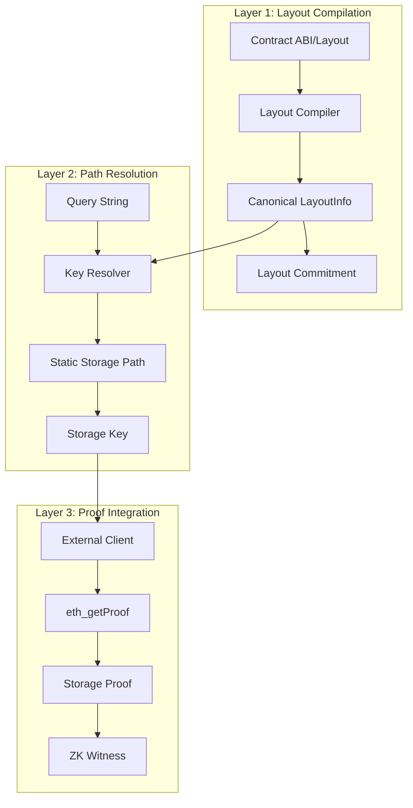
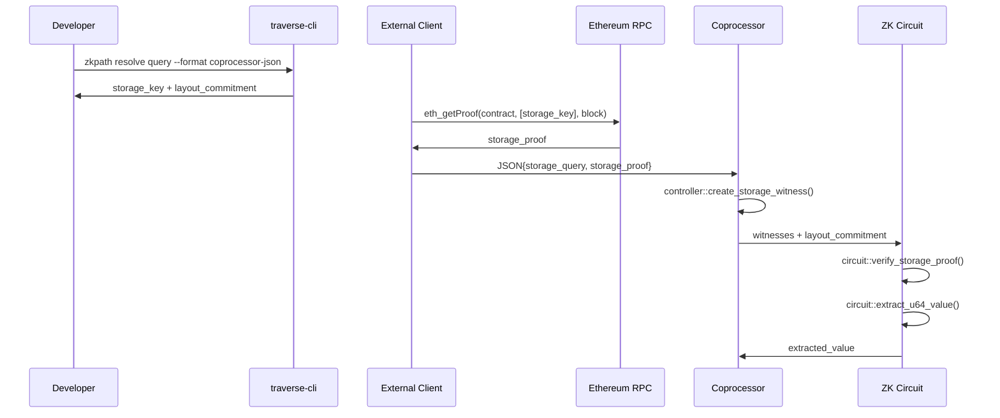

# Traverse Architecture

Traverse is a ZK storage path generator designed for blockchain state verification in zero-knowledge circuits. The system provides deterministic storage key generation and proof verification capabilities optimized for the Valence coprocessor infrastructure.

### Key Design Principles

- **Deterministic**: All operations produce identical results across environments
- **no_std Compatible**: Core functionality works in constrained WASM/RISC-V circuit environments
- **Modular**: Clean separation between setup and execution phases
- **Extensible**: Can be extended to support multiple chain backends

## System Architecture

### Three-Layer Architecture



#### Layer 1: Layout Compilation
Converts chain-specific contract layouts into canonical, deterministic format.

**Implementation**:
- `EthereumLayoutCompiler`: Processes Solidity storage layouts from `forge inspect`
- Generates `LayoutInfo` with normalized field information
- Computes SHA256-based layout commitment for circuit safety
- Supports packed storage fields with byte offsets

**Output**: Canonical `LayoutInfo` with commitment hash for verification

#### Layer 2: Path Resolution
Generates deterministic storage keys from human-readable queries.

**Implementation**:
- `EthereumKeyResolver`: Ethereum-specific storage key derivation
- Supports mappings, arrays, structs, and packed fields
- Uses Keccak256 for Ethereum storage slot calculation
- Produces `StaticKeyPath` with layout commitment verification

**Output**: Storage keys ready for blockchain queries and ZK circuit verification

#### Layer 3: Proof Integration
Bridges between blockchain state and ZK circuit verification.

**Implementation**:
- CLI tools for external storage key generation
- `traverse-valence` crate for coprocessor integration
- Controller, circuit, and domain helpers for witness creation
- Support for batch operations and error handling

**Output**: ZK witnesses and validated state proofs

## File Structure

### Core Crates

```
traverse/
├── crates/
│   ├── traverse-core/       # Core types and traits (no_std)
│   ├── traverse-ethereum/   # Ethereum-specific implementation (std)
│   ├── traverse-cli/        # CLI tools for key generation (std)
│   └── traverse-valence/    # Valence coprocessor integration (no_std)
```

#### traverse-core
Core traits, types, and no_std-compatible functionality.

**Key Components**:
```rust
pub trait LayoutCompiler {
    fn compile_layout(&self, abi_path: &Path) -> Result<LayoutInfo>;
}

pub trait KeyResolver {
    fn resolve(&self, layout: &LayoutInfo, query: &str) -> Result<StaticKeyPath>;
    fn resolve_all(&self, layout: &LayoutInfo) -> Result<Vec<StaticKeyPath>>;
}

pub struct LayoutInfo {
    pub version: String,
    pub types: HashMap<String, TypeInfo>,
    pub storage: Vec<StorageEntry>,
    pub commitment: [u8; 32],
}

pub enum Key {
    Fixed([u8; 32]),      // Fixed-size storage keys
    Variable(Vec<u8>),    // Variable-length keys (future chains)
}
```

**Dependencies**: `serde`, `sha2`, `hex` (all no_std compatible)

#### traverse-ethereum
Ethereum-specific implementations and blockchain integration.

**Key Components**:
```rust
pub struct EthereumLayoutCompiler;
pub struct EthereumKeyResolver;
pub struct EthereumProofFetcher;

impl KeyResolver for EthereumKeyResolver {
    fn resolve(&self, layout: &LayoutInfo, query: &str) -> Result<StaticKeyPath> {
        // Parse query and derive storage slot using Keccak256
        // Handle mappings: keccak256(pad(key) ++ pad(slot))
        // Handle arrays: slot + index
        // Handle structs: slot + field_offset
    }
}
```

**Storage Key Derivation**:

| Storage Type | Key Derivation Formula | Notes |
|--------------|------------------------|-------|
| **Mappings** | `keccak256(abi.encode(key, slot))` | Standard Solidity mapping storage |
| **Arrays** | `slot + index` | With overflow checking |
| **Structs** | `base_slot + field_offset` | Field byte offset within slot |
| **Packed Fields** | `slot + byte_offset` | Multiple values in single storage word |

**Dependencies**: `ethers`, `tiny-keccak`, `rlp`, `tokio`

#### traverse-cli
Command-line interface for external storage key generation.

**Commands**:
- `compile-layout`: Convert ABI to canonical layout
- `resolve`: Generate single storage key with coprocessor JSON export
- `resolve-all`: Generate all possible storage keys from layout
- `batch-resolve`: Process multiple queries from file
- `generate-proof`: Mock proof generation (extensible)

**Coprocessor Integration**:
```bash
# Generate storage key for valence coprocessor
zkpath resolve "_balances[0x742d35...]" \
  --layout contract.json \
  --format coprocessor-json > query.json
```

**Output Format**:
```json
{
  "query": "_balances[0x742d35Cc6aB8B23c0532C65C6b555f09F9d40894]",
  "storage_key": "c1f51986c7e9d391993039c3c40e41ad9f26e1db9b80f8535a639eadeb1d1bd9",
  "layout_commitment": "f6dc3c4a79e95565b3cf38993f1a120c6a6b467796264e7fd9a9c8675616dd7a",
  "field_size": 32,
  "offset": null
}
```

#### traverse-valence
Valence coprocessor integration with no_std compatibility.

**Architecture**:
```rust
// Controller helpers (anyhow compatible)
pub mod controller {
    pub fn create_storage_witness(json_args: &Value) -> Result<Witness, TraverseValenceError>;
    pub fn create_batch_storage_witnesses(json_args: &Value) -> Result<Vec<Witness>, TraverseValenceError>;
}

// Circuit helpers (no_std)
pub mod circuit {
    pub fn verify_storage_proof(witness: &Witness) -> Result<Vec<u8>, TraverseValenceError>;
    pub fn extract_u64_value(witness: &Witness) -> Result<u64, TraverseValenceError>;
    pub fn extract_address_value(witness: &Witness) -> Result<[u8; 20], TraverseValenceError>;
    pub fn extract_multiple_u64_values(witnesses: &[Witness]) -> Result<Vec<u64>, TraverseValenceError>;
}

// Domain helpers (no_std)
pub mod domain {
    pub fn parse_state_proof_data(args: &Value) -> Result<(Vec<u8>, Vec<u8>, Vec<u8>), TraverseValenceError>;
    pub fn parse_block_data(args: &Value) -> Result<(u64, Vec<u8>, Vec<u8>), TraverseValenceError>;
    pub fn validate_ethereum_state_proof(storage_proof: &Value, block_header: &EthereumBlockHeader) -> Result<ValidatedStateProof, TraverseValenceError>;
}
```

## Valence Coprocessor Integration

### Two-Phase Structure

#### Setup Phase (External, std-compatible)
This phase runs on developer machines, CI/CD systems, and external clients where the full standard library is available along with network access and file I/O capabilities.

**Workflow**:
1. **Layout Compilation**: Convert contract ABIs to canonical format
2. **Storage Key Generation**: Use CLI tools to generate storage keys
3. **External Proof Fetching**: 3rd party clients call `eth_getProof`
4. **JSON Payload Creation**: Combine storage keys with proof data

**Example**:
```bash
# 1. Compile contract layout
zkpath compile-layout Token.abi.json > layout.json

# 2. Generate storage keys
zkpath resolve "_balances[0x742d35...]" --layout layout.json --format coprocessor-json

# 3. External client combines with eth_getProof data
# 4. Submit JSON payload to coprocessor
```

#### Execution Phase (Coprocessor, no_std)
This phase runs within WASM runtimes and ZK circuits in constrained memory environments, operating with no_std compatibility, limited memory, and deterministic execution requirements.

**Components**:

1. **Controller** (WASM-compatible):
   ```rust
   pub fn get_witnesses(json_args: Value) -> Result<Vec<Witness>, anyhow::Error> {
       let witnesses = controller::create_batch_storage_witnesses(&json_args)?;
       Ok(witnesses)
   }
   ```

2. **Circuit** (no_std, ZK-compatible):
   ```rust
   pub fn verify_and_extract(witnesses: &[Witness]) -> Result<Vec<u64>, TraverseValenceError> {
       let mut results = Vec::new();
       for witness in witnesses {
           let balance = circuit::extract_u64_value(witness)?;
           results.push(balance);
       }
       Ok(results)
   }
   ```

3. **Domain** (no_std, validation):
   ```rust
   pub fn validate_state_proofs(proofs: &[Value]) -> Result<bool, TraverseValenceError> {
       for proof in proofs {
           let header = domain::EthereumBlockHeader {
               number: 0,
               state_root: [0u8; 32],
               hash: [0u8; 32],
           };
           let validated = domain::validate_ethereum_state_proof(proof, &header)?;
           if !validated.is_valid { return Ok(false); }
       }
       Ok(true)
   }
   ```

### Data Flow



## Security Architecture

### Layout Commitment System

Prevent circuits manipulation attacks through deterministic layout verification.

**Implementation**:
```rust
pub fn compute_layout_commitment(layout: &LayoutInfo) -> [u8; 32] {
    let normalized = normalize_layout_for_commitment(layout);
    sha2::Sha256::digest(&normalized).into()
}
```

**Security Properties**:
The layout commitment system provides deterministic behavior where the same layout always produces the same commitment, while any layout change produces a different commitment for tamper detection. Commitments can be verified directly in ZK circuits and are cryptographically secure through SHA256-based collision resistance.

### Storage Key Validation

**Attack Vector**: Malicious storage keys targeting arbitrary contract state.

**Defense**:
```rust
pub fn validate_storage_key_derivation(
    query: &str,
    derived_key: &[u8; 32],
    layout: &LayoutInfo,
) -> Result<bool, ValidationError> {
    // Re-derive key from query and layout
    let expected_key = derive_storage_key(query, layout)?;
    Ok(derived_key == &expected_key)
}
```

**Validation Layers**:
The system employs multiple validation layers: query syntax validation against known field patterns, field allowlisting to restrict access to approved contract fields, derivation verification that re-derives and compares storage keys, and range checking to validate array indices and struct offsets.

### Proof Verification

**Critical Path**: All storage proofs must be cryptographically verified.

**Implementation**:
```rust
pub fn verify_storage_proof(
    proof: &StorageProof,
    state_root: &[u8; 32],
    account_address: &[u8; 20],
) -> Result<bool, ProofError> {
    // 1. Verify account proof against state root
    // 2. Extract account storage root
    // 3. Verify storage proof against storage root
    // 4. Validate Merkle-Patricia trie inclusion
    Ok(true) // Simplified for current implementation
}
```

### Optimization Strategies

The system employs several optimization strategies for production performance. Batch operations process multiple queries together for efficiency, while proof compression minimizes proof node storage overhead. Layout caching pre-computes layout commitments to avoid repeated calculations, and field-specific extraction functions provide optimized access patterns for common data types.

## Deployment Phases

1. **Development**:
   ```bash
   # Generate storage keys during development
   zkpath compile-layout contracts/Token.abi.json > layouts/token.json
   zkpath resolve-all --layout layouts/token.json --format coprocessor-json > keys/token_keys.json
   ```

2. **Integration**:
   ```rust
   // Add traverse-valence to coprocessor app
   [dependencies]
   traverse-valence = { version = "0.1.0", default-features = false }
   ```

3. **Runtime**:
   ```rust
   // Controller receives pre-computed storage keys + proofs
   let witnesses = controller::create_batch_storage_witnesses(&json_args)?;
   
   // Circuit verifies proofs and extracts values
   let balances = circuit::extract_multiple_u64_values(&witnesses)?;
   ```