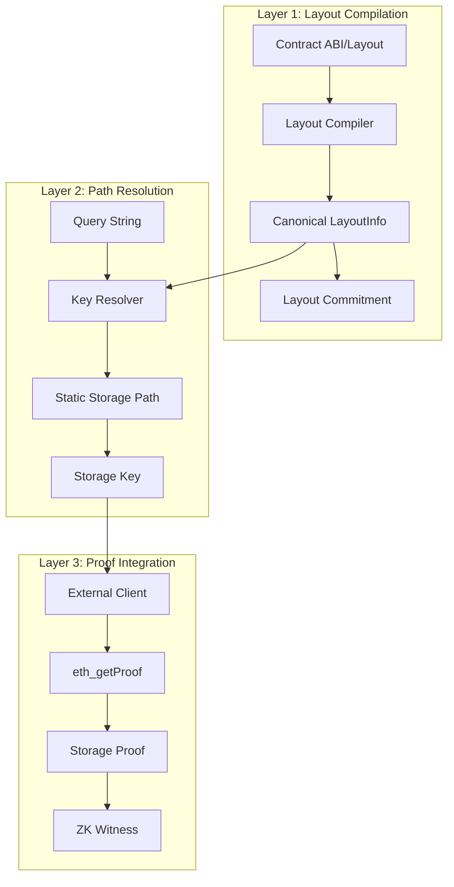
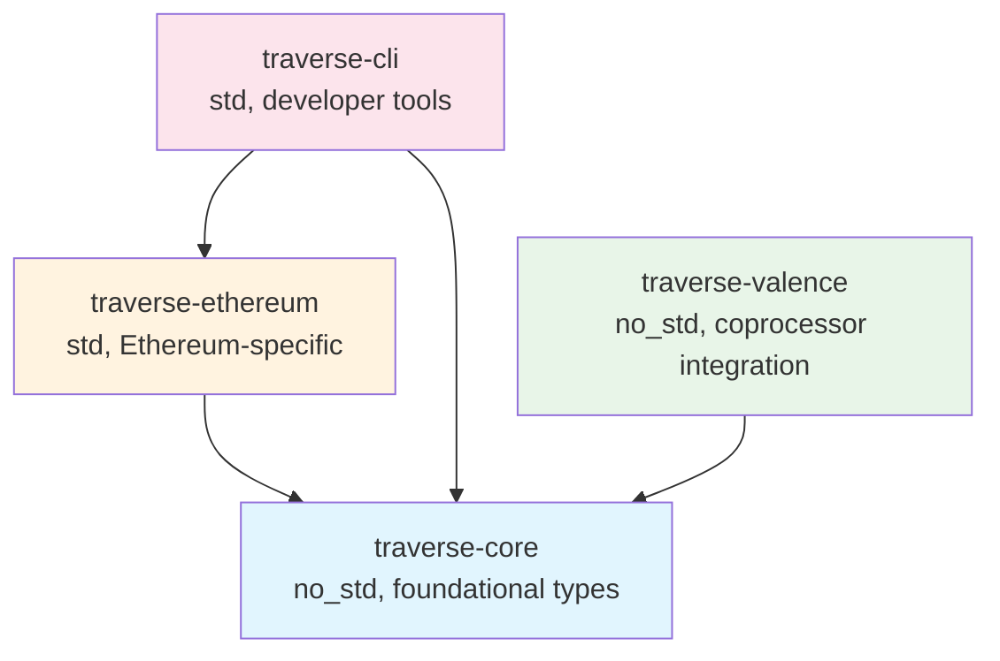
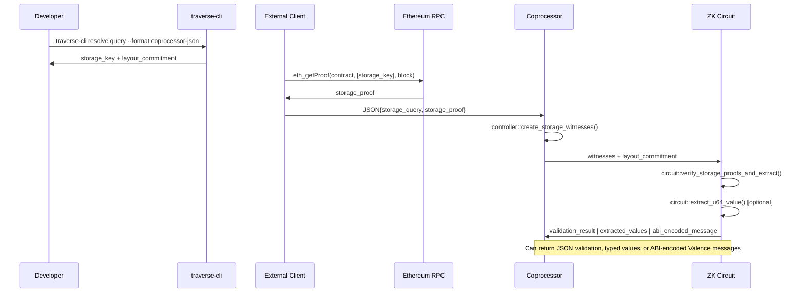

# Traverse Architecture

Traverse is a ZK storage path generator designed for blockchain state verification in zero-knowledge circuits. The system provides deterministic storage key generation and proof verification capabilities optimized for the Valence coprocessor infrastructure.

### Design Principles

- **Deterministic**: All operations produce identical results across environments
- **no_std Compatible**: Core functionality works in constrained WASM/RISC-V circuit environments
- **Modular**: Clean separation between setup and execution phases
- **Extensible**: Can be extended to support multiple chain backends

## System Architecture

### Three-Layer Architecture



#### Layer 1: Layout Compilation
Converts chain-specific contract layouts into canonical, deterministic format.

**Implementation**:
- `EthereumLayoutCompiler`: Processes Solidity storage layouts from `forge inspect`
- Generates `LayoutInfo` with normalized field information
- Computes SHA256-based layout commitment for circuit safety
- Supports packed storage fields with byte offsets

**Output**: Canonical `LayoutInfo` with commitment hash for verification

#### Layer 2: Path Resolution
Generates deterministic storage keys from human-readable queries.

**Implementation**:
- `EthereumKeyResolver`: Ethereum-specific storage key derivation
- Supports mappings, arrays, structs, and packed fields
- Uses Keccak256 for Ethereum storage slot calculation
- Produces `StaticKeyPath` with layout commitment verification

**Output**: Storage keys ready for blockchain queries and ZK circuit verification

#### Layer 3: Proof Integration
Bridges between blockchain state and ZK circuit verification.

**Implementation**:
- CLI tools for external storage key generation
- `traverse-valence` crate for coprocessor integration
- Controller, circuit, and domain helpers for witness creation
- Support for batch operations and error handling

**Output**: ZK witnesses and validated state proofs

## Crate Overview

Traverse is organized into four specialized crates, each serving a distinct role in the storage proof generation pipeline:

### traverse-core
**Purpose**: Foundation types and traits for chain-independent storage operations  
**Environment**: `no_std` compatible for circuit usage  
**Key Responsibility**: Defines the core abstractions (`LayoutInfo`, `StaticKeyPath`, `Key`) that all other crates build upon  
**Usage**: Included in ZK circuits where memory and dependencies are constrained  

### traverse-ethereum  
**Purpose**: Ethereum-specific implementations of core traits  
**Environment**: Standard library with network access  
**Key Responsibility**: Converts Solidity ABIs to canonical layouts, resolves storage queries to Ethereum storage keys using Keccak256  
**Usage**: Build tools and external clients that need to interact with Ethereum contracts  

### traverse-cli
**Purpose**: Command-line interface for storage key generation and proof fetching  
**Environment**: Standard library with filesystem and network access  
**Key Responsibility**: Provides developer tools for layout compilation, query resolution, and proof generation  
**Usage**: Development workflows, CI/CD pipelines, and external client integration  

### traverse-valence
**Purpose**: Integration layer for Valence coprocessor framework with full message type support  
**Environment**: `no_std` compatible with optional `std` and `alloy` features  
**Key Responsibility**: Bridges between Traverse's storage paths and Valence's three-tier architecture (controller/circuit/domain), provides ABI encoding for Valence Authorization contracts  
**Usage**: ZK circuits and coprocessor applications that need storage proof verification with Valence ecosystem integration  

### Crate Dependencies



The design ensures that circuit-compatible crates (`traverse-core`, `traverse-valence`) remain lightweight with minimal dependencies, while tool crates (`traverse-ethereum`, `traverse-cli`) can use the full standard library for complex operations.

## File Structure

### Core Crates

```
traverse/
├── crates/
│   ├── traverse-core/       # Core types and traits (no_std)
│   ├── traverse-ethereum/   # Ethereum-specific implementation (std)
│   ├── traverse-cli/        # CLI tools for key generation (std)
│   └── traverse-valence/    # Valence coprocessor integration (no_std)
```

#### traverse-core
Core traits, types, and no_std-compatible functionality.

**Key Components**:
```rust
pub trait LayoutCompiler {
    fn compile_layout(&self, abi_path: &Path) -> Result<LayoutInfo>;
}

pub trait KeyResolver {
    fn resolve(&self, layout: &LayoutInfo, query: &str) -> Result<StaticKeyPath>;
    fn resolve_all(&self, layout: &LayoutInfo) -> Result<Vec<StaticKeyPath>>;
}

pub struct LayoutInfo {
    pub contract_name: String,
    pub storage: Vec<StorageEntry>,
    pub types: Vec<TypeInfo>,
}

pub struct StorageEntry {
    pub label: String,
    pub slot: String,
    pub offset: u8,
    pub type_name: String,
    pub zero_semantics: ZeroSemantics,
}

pub enum Key {
    Fixed([u8; 32]),      // Fixed-size storage keys
    Variable(Vec<u8>),    // Variable-length keys (future chains)
}
```

**Dependencies**: `serde`, `sha2`, `hex` (all no_std compatible)

#### traverse-ethereum
Ethereum-specific implementations and blockchain integration.

**Key Components**:
```rust
pub struct EthereumLayoutCompiler;
pub struct EthereumKeyResolver;
pub struct EthereumProofFetcher;

impl KeyResolver for EthereumKeyResolver {
    fn resolve(&self, layout: &LayoutInfo, query: &str) -> Result<StaticKeyPath> {
        // Parse query and derive storage slot using Keccak256
        // Handle mappings: keccak256(pad(key) ++ pad(slot))
        // Handle arrays: slot + index
        // Handle structs: slot + field_offset
    }
}
```

**Storage Key Derivation**:

| Storage Type | Key Derivation Formula | Notes |
|--------------|------------------------|-------|
| **Mappings** | `keccak256(abi.encode(key, slot))` | Standard Solidity mapping storage |
| **Arrays** | `slot + index` | With overflow checking |
| **Structs** | `base_slot + field_offset` | Field byte offset within slot |
| **Packed Fields** | `slot + byte_offset` | Multiple values in single storage word |

**Dependencies**: `alloy`, `tiny-keccak`, `rlp`, `tokio`

#### traverse-cli
Command-line interface for external storage key generation.

**Commands**:
- `compile-layout`: Convert ABI to canonical layout
- `resolve`: Generate single storage key with coprocessor JSON export
- `resolve-all`: Generate all possible storage keys from layout
- `batch-resolve`: Process multiple queries from file
- `generate-proof`: Generate storage proofs (requires client feature for live proofs)

**Coprocessor Integration**:
```bash
# Generate storage key for valence coprocessor
traverse-cli resolve "_balances[0x742d35...]" \
  --layout contract.json \
  --format coprocessor-json > query.json
```

**Output Format**:
```json
{
  "query": "_balances[0x742d35Cc6aB8B23c0532C65C6b555f09F9d40894]",
  "storage_key": "c1f51986c7e9d391993039c3c40e41ad9f26e1db9b80f8535a639eadeb1d1bd9",
  "layout_commitment": "f6dc3c4a79e95565b3cf38993f1a120c6a6b467796264e7fd9a9c8675616dd7a",
  "field_size": 32,
  "offset": null
}
```

#### traverse-valence
Valence coprocessor integration with no_std compatibility and comprehensive Valence ecosystem support.

**Purpose**: Integration layer for Valence coprocessor framework with full message type support  
**Environment**: `no_std` compatible with optional `std` and `alloy` features  
**Key Responsibility**: Bridges between Traverse's storage paths and Valence's three-tier architecture (controller/circuit/domain), provides ABI encoding for Valence Authorization contracts  
**Usage**: ZK circuits and coprocessor applications that need storage proof verification with Valence ecosystem integration  

**Architecture**:
```rust
// Controller helpers - Standard Valence entry point
pub fn create_storage_witnesses(json_args: &Value) -> Result<Vec<Witness>, TraverseValenceError>;

// Circuit helpers - Standard Valence entry point
pub fn verify_storage_proofs_and_extract(witnesses: Vec<Witness>) -> Vec<u8>;

// Individual value extraction
pub fn extract_u64_value(witness: &Witness) -> Result<u64, TraverseValenceError>;
pub fn extract_address_value(witness: &Witness) -> Result<[u8; 20], TraverseValenceError>;
pub fn extract_raw_bytes(witness: &Witness) -> Result<[u8; 32], TraverseValenceError>;

// Batch operations
pub fn extract_multiple_u64_values(witnesses: &[Witness]) -> Result<Vec<u64>, TraverseValenceError>;
pub fn extract_multiple_address_values(witnesses: &[Witness]) -> Result<Vec<[u8; 20]>, TraverseValenceError>;

// Domain validation
pub fn validate_ethereum_state_proof(storage_proof: &Value, block_header: &EthereumBlockHeader) -> Result<ValidatedStateProof, TraverseValenceError>;
```

**Valence Ecosystem Integration**:
```rust
// Message structures for Valence Authorization contracts
pub struct ZkMessage {
    pub registry: u64,
    pub block_number: u64,
    pub authorization_contract: String,
    pub processor_message: ProcessorMessage,
}

pub struct SendMsgs {
    pub execution_id: u64,
    pub priority: Priority,
    pub subroutine: Subroutine,
    pub expiration_time: u64,
    pub messages: Vec<Vec<u8>>,
}

// ABI encoding helpers (alloy feature)
pub mod abi_encoding {
    pub fn encode_zk_message(msg: &ZkMessage) -> Result<Vec<u8>, TraverseValenceError>;
}

// Helper functions for creating Valence-compatible messages
pub fn create_storage_validation_message(
    validation_result: StorageProofValidationResult,
    execution_id: u64,
) -> ZkMessage;
```

**Standard Valence Integration Pattern**:
```rust
use traverse_valence::{controller, circuit};
use serde_json::Value;
use valence_coprocessor::Witness;

// Standard Valence controller entry point
pub fn get_witnesses(args: Value) -> anyhow::Result<Vec<Witness>> {
    controller::create_storage_witnesses(&args)
}

// Standard Valence circuit entry point  
pub fn circuit(witnesses: Vec<Witness>) -> Vec<u8> {
    circuit::verify_storage_proofs_and_extract(witnesses)
}
```

**Witness Data Structure**:

Each witness contains a structured format for storage proof verification:
- **32 bytes**: Storage key (pre-computed by traverse-cli)
- **32 bytes**: Layout commitment (for verification) 
- **32 bytes**: Storage value (from eth_getProof)
- **4 bytes**: Proof data length (little-endian u32)
- **N bytes**: Merkle proof data (variable length)

This format enables both individual and batch verification operations while maintaining compatibility with Valence coprocessor patterns.

## Valence Coprocessor Integration

### Two-Phase Structure

#### Setup Phase (External, std-compatible)
This phase runs on developer machines, CI/CD systems, and external clients where the full standard library is available along with network access and file I/O capabilities.

**Workflow**:
1. **Layout Compilation**: Convert contract ABIs to canonical format
2. **Storage Key Generation**: Use CLI tools to generate storage keys
3. **External Proof Fetching**: 3rd party clients call `eth_getProof`
4. **JSON Payload Creation**: Combine storage keys with proof data

**Example**:
```bash
# 1. Compile contract layout
traverse-cli compile-layout Token.abi.json > layout.json

# 2. Generate storage keys
traverse-cli resolve "_balances[0x742d35...]" --layout layout.json --format coprocessor-json

# 3. External client combines with eth_getProof data
# 4. Submit JSON payload to coprocessor
```

#### Execution Phase (Coprocessor, no_std)
This phase runs within WASM runtimes and ZK circuits in constrained memory environments, operating with no_std compatibility, limited memory, and deterministic execution requirements.

**Components**:

1. **Controller** (WASM-compatible):
   ```rust
   pub fn get_witnesses(json_args: Value) -> Result<Vec<Witness>, anyhow::Error> {
       let witnesses = controller::create_batch_storage_witnesses(&json_args)?;
       Ok(witnesses)
   }
   ```

2. **Circuit** (no_std, ZK-compatible):
   ```rust
   pub fn circuit(witnesses: Vec<Witness>) -> Vec<u8> {
       circuit::verify_storage_proofs_and_extract(witnesses)
   }
   
   // Custom extraction for specific applications
   pub fn verify_and_extract_balances(witnesses: &[Witness]) -> Result<Vec<u64>, TraverseValenceError> {
       let mut results = Vec::new();
       for witness in witnesses {
           let balance = circuit::extract_u64_value(witness)?;
           results.push(balance);
       }
       Ok(results)
   }
   ```

3. **Domain** (no_std, validation):
   ```rust
   pub fn validate_state_proofs(proofs: &[Value]) -> Result<bool, TraverseValenceError> {
       for proof in proofs {
           let header = domain::EthereumBlockHeader {
               number: 0,
               state_root: [0u8; 32],
               hash: [0u8; 32],
           };
           let validated = domain::validate_ethereum_state_proof(proof, &header)?;
           if !validated.is_valid { return Ok(false); }
       }
       Ok(true)
   }
   ```

### Message Flow Integration

**Production Valence Integration**: The traverse-valence crate now provides complete Valence ecosystem integration following the same patterns as valence-coprocessor-app. This includes:

- **Standard Entry Points**: `get_witnesses()` and `circuit()` functions matching Valence conventions
- **Message Structures**: Complete Valence message types (ZkMessage, SendMsgs, ProcessorMessage, etc.)
- **ABI Encoding**: Alloy-based ABI encoding for Valence Authorization contracts
- **Batch Operations**: Support for multiple storage proof verification in single coprocessor execution

**Integration with Valence Authorization Contracts**: Applications can now generate ABI-encoded messages that integrate with the broader Valence ecosystem for complex contract execution flows.

### Data Flow



## Traverse Phases

The layout commitment system provides deterministic behavior where the same layout always produces the same commitment, while any layout change produces a different commitment for tamper detection. Commitments can be verified directly in ZK circuits and are cryptographically secure through SHA256-based collision resistance.

#### 1. Commitment Computation

The commitment acts as a "fingerprint" of the contract's storage structure. By hashing all the essential layout details together—variable names, storage slots, byte offsets, and type information—we create a unique identifier that changes if any aspect of the contract's storage layout is modified. 

A contract's **storage layout** consists of:
- **Variable names and positions**: Which storage variables exist (`_balances`, `_totalSupply`, etc.) and their assigned storage slots
- **Data types and sizes**: Whether a field is `uint256`, `address`, `mapping`, etc., and how many bytes each occupies
- **Packing and offsets**: How multiple smaller variables are packed into single 32-byte storage slots
- **Mapping and array structures**: The key/value types for mappings and element types for arrays

This ensures that a ZK circuit compiled for one contract version cannot accidentally (or maliciously) be used with a different contract layout, preventing bugs and attacks where storage slots might be misinterpreted. For example, if a contract upgrade changes a `uint128` field to `uint256`, or reorders storage variables, the commitment would change and alert the circuit to the layout mismatch.

The commitment hash includes all layout-critical information:

```rust
impl LayoutInfo {
    pub fn commitment(&self) -> [u8; 32] {
        // Deterministic hash of layout structure
        let mut hasher = Sha256::new();
        
        // Hash contract name with length prefix
        hasher.update((self.contract_name.len() as u32).to_le_bytes());
        hasher.update(self.contract_name.as_bytes());
        
        // Hash number of storage entries
        hasher.update((self.storage.len() as u32).to_le_bytes());
        
        // Hash each storage entry in order
        for entry in &self.storage {
            hasher.update((entry.label.len() as u32).to_le_bytes());
            hasher.update(entry.label.as_bytes());
            hasher.update((entry.slot.len() as u32).to_le_bytes());
            hasher.update(entry.slot.as_bytes());
            hasher.update((entry.offset as u32).to_le_bytes());
            hasher.update((entry.type_name.len() as u32).to_le_bytes());
            hasher.update(entry.type_name.as_bytes());
        }
        
        hasher.finalize().into()
    }
}
```

#### 2. Compile-time Storage Layout Integration into the Circuit

During the setup phase, `traverse-cli` generates compile-time constants that are baked into the circuit binary. These constants include the layout commitment (a cryptographic hash of the contract's storage structure) and pre-computed storage keys for specific queries. By embedding these as constants, the circuit avoids expensive runtime computation and ensures deterministic behavior - the same circuit will always work with the same contract layout.

```rust
pub mod precomputed_paths {
    pub const MOCK_ERC20_LAYOUT_COMMITMENT: [u8; 32] = [
        246, 220, 60, 74, 121, 233, 85, 101, 179, 207, 56, 153, 63, 26, 18, 12,
        106, 107, 70, 119, 150, 38, 78, 127, 217, 169, 200, 103, 86, 22, 221, 122
    ];
    
    pub const BALANCE_PATH_742D35: StaticKeyPath = StaticKeyPath {
        name: "balances[0x742d35Cc6634C0532925a3b8D97C2e0D8b2D9C]",
        key: Key::Fixed([/* pre-computed storage key */]),
        layout_commitment: MOCK_ERC20_LAYOUT_COMMITMENT,
    };
}
```

#### 3. Runtime Verification

At runtime, the circuit receives storage proof data from external clients and must verify it against the compile-time constants. The circuit performs three critical checks:
1. Verify the layout commitment matches the layout in the compilation step.
2. Confirm the storage key in the proof matches the pre-computed key for the query.
3. Extract the actual value from the verified storage slot.

This approach moves all the complex ABI parsing and storage key computation out of the circuit, leaving only simple verification and value extraction.

```rust
pub fn verify_erc20_balance(
    path: &StaticKeyPath,
    payload: &CircuitStorageProof,
    expected_commitment: &[u8; 32],
    min_balance: u64,
) -> Result<bool, &'static str> {
    // 1. Layout commitment verification (critical security check)
    if &path.layout_commitment != expected_commitment {
        return Err("Layout commitment mismatch");
    }
    
    // 2. Storage key verification  
    let storage_key = match &path.key {
        Key::Fixed(key) => *key,
        Key::Variable(_) => return Err("Expected fixed key"),
    };
    
    if payload.key != storage_key {
        return Err("Storage key mismatch");
    }
    
    // 3. Extract and validate value
    let balance = u64_from_be_bytes(&payload.value[24..32]);
    Ok(balance >= min_balance)
}
```

### Architectural Benefits

#### Performance Advantages

| Aspect | Commitment System | Circuit Deserialization |
|--------|------------------|-------------------------|
| **Circuit Memory** | ~64 bytes per path | ~10KB+ ABI data |
| **Proving Time** | Fast (hash verification) | Slow (full parsing) |
| **Determinism** | Compile-time constants | Runtime computation |
| **Security** | Tamper-evident hashes | Trust external ABI |
| **Complexity** | Simple verification | Complex parsing logic |

#### Security Advantages

1. **ABI Substitution Protection**: Prevents attackers from providing modified contract layouts
2. **Layout Tampering Detection**: Any change to storage structure invalidates the commitment
3. **Circuit-Layout Alignment**: Ensures circuit was compiled with correct contract interface
4. **Deterministic Verification**: Same layout always produces identical circuit behavior

#### Commitment vs. Circuit Deserialization

The commitment system fundamentally changes **where** and **when** layout processing happens, optimizing for circuit performance and security.

**In-circuit Deserialization Approach**:
```rust
// Circuit does everything - expensive and complex
fn circuit_main() {
    let layout = parse_abi_in_circuit(&abi_bytes);     // Expensive parsing
    let storage_key = resolve_mapping(&layout, query); // Complex computation
    let verified_value = verify_merkle_proof(&proof);  // Memory intensive
    let balance = extract_value(&verified_value);
}
```

**Traverse Commitment Approach**:
```rust
// Setup Phase (External)
traverse-cli compile-layout Token.abi.json > layout.json
traverse-cli resolve "_balances[0x742d...]" --layout layout.json

// Circuit (Minimal)
pub const BALANCE_PATH: StaticKeyPath = StaticKeyPath {
    key: Key::Fixed([0x1a, 0x2b, ...]),        // Pre-computed
    layout_commitment: [0xf6, 0xdc, ...],       // Expected hash
};

fn circuit_main() {
    if path.layout_commitment != EXPECTED_COMMITMENT {
        return Err("Layout mismatch");           // Simple hash check
    }
    let balance = extract_u64(&payload.value);  // Direct extraction
}
```

### Storage Key Validation

**Attack Vector**: Malicious storage keys targeting arbitrary contract state.

**Defense**:
```rust
pub fn validate_storage_key_derivation(
    query: &str,
    derived_key: &[u8; 32],
    layout: &LayoutInfo,
) -> Result<bool, ValidationError> {
    // Re-derive key from query and layout
    let expected_key = derive_storage_key(query, layout)?;
    Ok(derived_key == &expected_key)
}
```

**Validation Layers**:
The system employs multiple validation layers: query syntax validation against known field patterns, field allowlisting to restrict access to approved contract fields, derivation verification that re-derives and compares storage keys, and range checking to validate array indices and struct offsets.

### Proof Verification

**Critical Path**: All storage proofs must be cryptographically verified.

**Implementation**:
```rust
pub fn verify_storage_proof(
    proof: &StorageProof,
    state_root: &[u8; 32],
    account_address: &[u8; 20],
) -> Result<bool, ProofError> {
    // 1. Verify account proof against state root
    // 2. Extract account storage root
    // 3. Verify storage proof against storage root
    // 4. Validate Merkle-Patricia trie inclusion
    Ok(true) // Simplified for current implementation
}
```

### Optimization Strategies

The system employs several optimization strategies for production performance. Batch operations process multiple queries together for efficiency, while proof compression minimizes proof node storage overhead. Layout caching pre-computes layout commitments to avoid repeated calculations, and field-specific extraction functions provide optimized access patterns for common data types.
